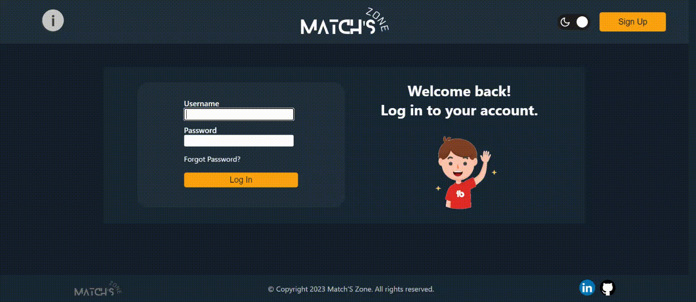

# Match'S Zone 🏟️

## Description

A database system that keeps track of clubs and their representatives, stadiums and their managers, matches between clubs, sports adminstration managers, fans and their ticket buying transactions. There are five different user roles with varying levels of access to the system, including system admins, club representatives, stadium managers, sports administration managers, and fans. The system provides a comprehensive solution for managing the various components of sports administration, including scheduling matches, assigning stadiums, and tracking ticket sales.

During the development of this project, I acquired new skills in React.js to design an attractive user interface, used SQL to create a complex database system, and utilized Node.js to establish a connection between the front-end and back-end of the system. This experience allowed me to enhance my knowledge in web development and expand my capabilities in creating efficient and functional software solutions.

---

## Installation

To install and run this project on your local machine, follow these steps:

1. Clone the repository or download the code as a ZIP file.

2. Create a new database with SQL-Authentication and update the values in ```db-files/dbConfig.js``` to match your database configuration.

3. Run the SQL queries found in ```db-files/database.sql``` to create the necessary tables and data.

4. Install the project's dependencies by running the command ```npm install``` in your terminal.

5. Start the project by running the command ```npm run dev``` in your terminal.

By following these steps, you'll be able to set up and run the project on your local machine.

---

## Usage


To demonstrate the system's capabilities, a default system admin user with the credentials username "admin" and password "admin" has been created. However, to fully utilize the system, you will need to register as different user types, as shown in the above GIF. As an administrator, you can create new clubs and stadiums, and then proceed to register new club representatives and stadium managers for each club and stadium. Additionally, you will need to register new sports association managers to schedule matches between clubs. Once these users are registered, club representatives can log in to request hosting of matches on available stadiums, while stadium managers can approve these requests. Finally, fans can log in to purchase tickets for available matches, completing the full user experience of the system.

<br><br>


|    Admin Functionalities    |
|:-------------------:|
| Administrators have complete control over clubs, stadiums, fans, and users. They can add/remove clubs and stadiums, block/unblock fans, and designate stadium availability for new matches. This level of control ensures that the system functions smoothly and that all elements are managed effectively.|

<br><br>


|    Sports Association Manager Functionalities    |
|:-------------------:|
| Sports association managers have access to all scheduled matches and can filter them based on date, either viewing only past matches or only future matches. They can also view pairs of clubs that have not yet been scheduled to play against each other. Additionally, managers have the ability to add and delete matches as needed.|

<br><br>


|    Club Representative Functionalities    |
|:-------------------:|
| Club representatives have access to all information related to their own club, including future scheduled matches. They can also view available stadiums in the system that are able to host matches and submit a request to host a match on one of the available stadiums, provided that their club is the host club of the upcoming match. Only one request per stadium is permitted for each match.|

<br><br>


|    Stadium Manager Functionalities    |
|:-------------------:|
| Stadium managers have access to all information related to their managed stadium, including upcoming matches scheduled to be played there and match host requests. Host club representatives can submit requests to play matches on the stadium, and the stadium manager can accept or decline the request based on the stadium's availability. If the stadium is available and no other match is scheduled at the requested time, the stadium manager can accept the request and update the system with available tickets for fans to purchase, according to the stadium's capacity. Only the stadium manager can set the availability of their stadium.|

<br><br>


|    Fan Functionalities    |
|:-------------------:|
| Fans can view all currently available matches with available tickets to purchase. They can access details about each match and buy tickets as desired. Once a fan purchases a ticket, they can view information about all of their purchased tickets and corresponding matches.|

<br><br>



|    Blocked Fan    |
|:-------------------:|
| System administrators have the authority to block fans and prevent them from accessing the system. Once a fan is blocked, they are no longer able to log in or use the system until they are unblocked by an administrator.|

<br><br>


## Badges


Check out the badges hosted by [shields.io](https://shields.io/). 
